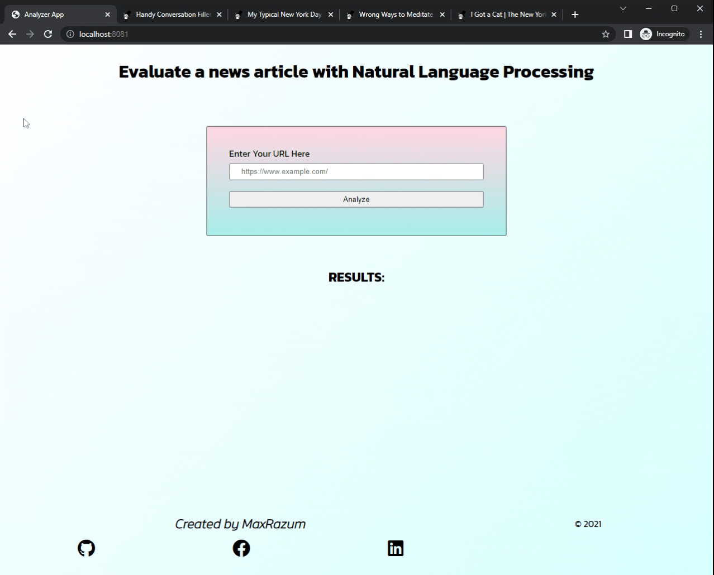

# Evaluate a News Article with Natural Language Processing

* This project allows users to run Natural Language Processing (NLP) on articles or blogs found on other websites, using information obtained from external API.

### LANGUAGES

    - Javascript
    - HTML
    - SCSS

### Built with

- [Node.js](https://nodejs.org/en/) - Node.js® is a JavaScript runtime built on Chrome's V8 JavaScript engine.
- [Express.js](https://expressjs.com/) - Fast, unopinionated, minimalist web framework for Node.js.
- [Webpack.js](https://webpack.js.org/) - Webpack takes modules with dependencies and generates static assets representing those modules.

## Preview


## Instructions

* Download the zip file locally.
* Navigate to the project directory `cd ***` Replace *** with the project directory.
* Install all dependencies using command `npm i`
* Go to [MeaningCloud](https://www.meaningcloud.com/developer/) and register for an account.
* At the root of the project, create a new file named `.env`
* Inside the file, add `API_KEY=replace this text with your API key from MeaningCloud`
* To run the developer server use command `npm run build-dev`
* The developer server runs on `localhost:8080`
```
* To run the production server use `npm run go`
* The production server runs on `localhost:8081`
```